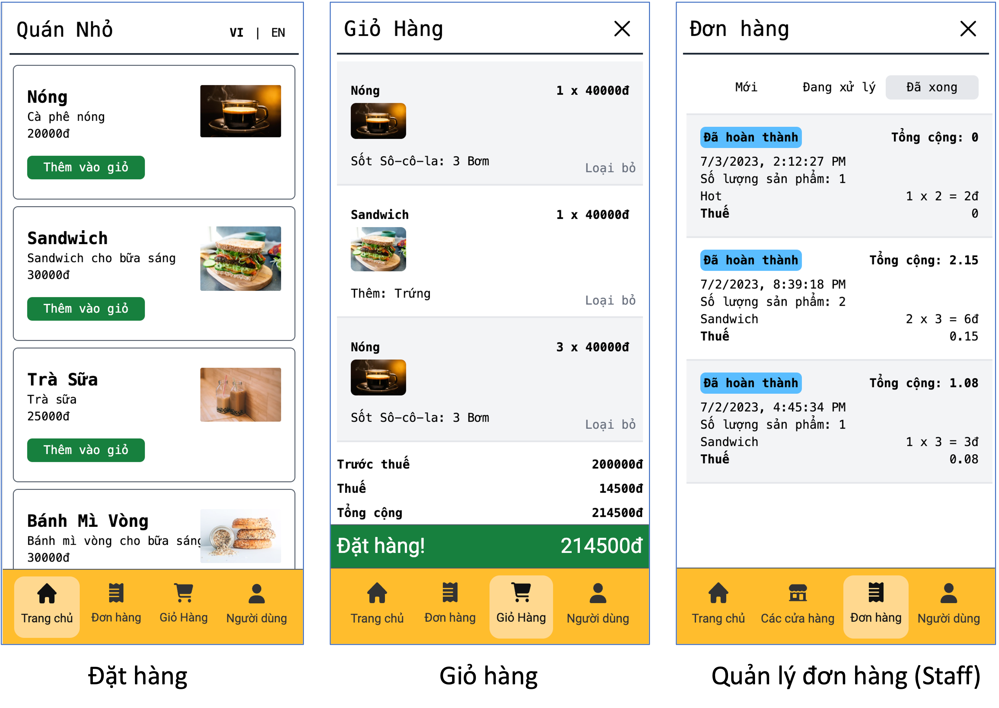
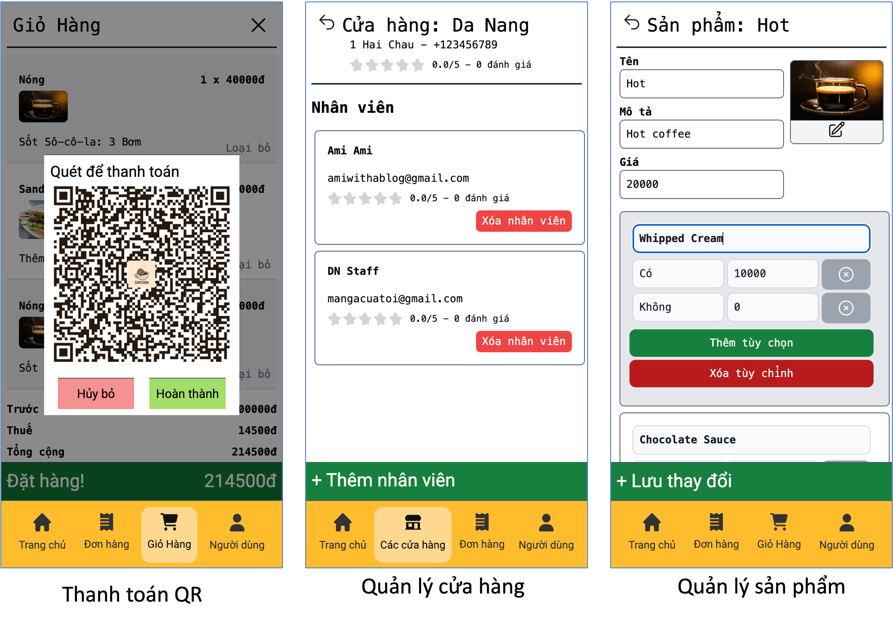

<p align="center">
  
  <h1 align="center">☕ Cafeteria App ☕</h1>
  <p align="center" style="font-weight: bold">Online ordering system for small coffee shops!</p>
</p>





- **Deployed at:** [https://cafe.vietanh.dev/](https://cafe.vietanh.dev/).
- **Frontend:** Next.js with Javascript, Tailwind CSS.
- **Database:** Google Firebase.
- **Authentication:** NextAuth.js with Google OAuth.
- **Deployment:** Vercel.
- **Developers:**
  - [Trinh Thu Hai](https://github.com/haitt00).
  - [Nguyen Viet Anh](https://github.com/vietanhdev).
  - [Mach Dieu Bang](https://github.com/BangMach).
  - [Bui Son Dong](https://github.com/perplexingcode).

## 1. Design

**UI Design:** [Open in Figma](https://www.figma.com/file/NWU9BqtgXH4WZmBuEWUlVH/Cafeteria?type=design&node-id=0%3A1&t=2CNfDxghbK04aOCP-1)

## 2. Getting Started

Copy `.env.example` to `.env` and fill in the environment variables.

- `FIREBASE*`: Firebase config. See [here](https://firebase.google.com/docs/web/setup#config-object).
- `NEXT_PUBLIC_GOOGLE_LOGIN`, `GOOGLE_ID`, `GOOGLE_SECRET`: Google OAuth config. See [here](https://next-auth.js.org/providers/google).
- `NEXT_PUBLIC_GITHUB_LOGIN`, `GITHUB_ID`, `GITHUB_SECRET`: Github OAuth config. See [here](https://next-auth.js.org/providers/github).

First, run the development server:

```bash
npm run dev
```

Open [http://localhost:3000](http://localhost:3000) with your browser to see the result.

## 3. Deployment

### 3.1. Local build and check

Build the app:

```bash
npm run build
```

Start the app:

```bash
npm run start
```

### 3.2. Deploy to Vercel

- Create a new project on [Vercel](https://vercel.com/).
- Add all environment variables to the project (see [.env.sample](.env.sample)).
- Deploy the app.

## 4. Generate Google OAuth 2.0 credentials

To generate Google OAuth 2.0 credentials for use with Next.js and React, you can follow these steps:

1. Go to the Google Cloud Platform Console: <https://console.cloud.google.com/>
2. If you don't have a project yet, click on the project dropdown menu at the top and create a new project.
3. Select your desired project from the dropdown menu.
4. In the left sidebar, click on "Credentials" under the "APIs & Services" section.
5. On the Credentials page, click on the "Create Credentials" button and select "OAuth client ID" from the dropdown menu.
6. Choose the application type based on your requirements. For Next.js and React, you can select "Web application."
7. Enter a name for your OAuth 2.0 client ID (e.g., "Next.js OAuth Client").
8. Under the "Authorized JavaScript origins" section, enter the URL where your Next.js application will run during development (e.g., <http://localhost:3000>). If you plan to deploy your application to a specific domain, add that as well.
9. Under the "Authorized redirect URIs" section, add the URL where your Next.js application will handle the OAuth callback. For local development, this could be <http://localhost:3000/api/auth/callback/google>. If you plan to deploy your application, include the appropriate domain and endpoint (ex: <https://cafe.vietanh.dev/api/auth/callback/google>).
10. Click on the "Create" button to generate your credentials.
11. On the Credentials page, locate your newly created OAuth 2.0. For this application, we prefer not to download this file. Instead, copy 2 values
    `Client ID`. For example: `6989....c0tukv3fnhm.apps.googleusercontent.com`.
    `Client secret`. For example: `GOC......hgyO`.
12. For local development, put these values inside .env file:
    `NEXT_PUBLIC_GOOGLE_LOGIN="true"`
    `GOOGLE_ID=6989....c0tukv3fnhm.apps.googleusercontent.com`
    `GOOGLE_SECRET=GOC......hgyO`
13. For Vercel cloud, put those values in the [Environment Variables](https://vercel.com/docs/concepts/projects/environment-variables).

With these credentials, you can implement Google OAuth 2.0 authentication in your Next.js and React application. Refer to the Google Sign-In documentation or NextAuth.js documentation for further instructions on integrating OAuth authentication into your application.
