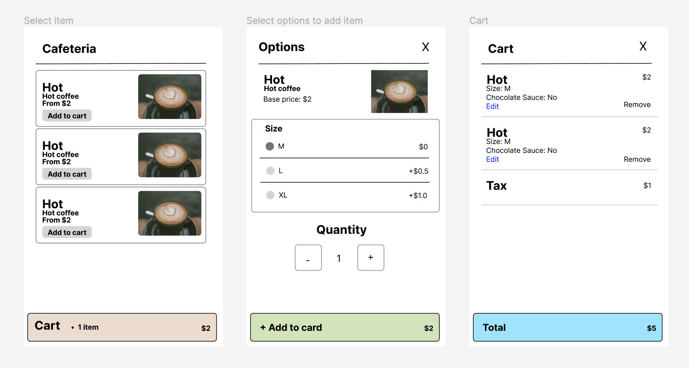

# Cafeteria App

This is a cafeteria app that allows users to order food from a cafeteria. It is built with Next.js, TypeScript, and Tailwind CSS.

Deployed at: [https://cafe.vietanh.dev/](https://cafe.vietanh.dev/).

## Design

**UI Mockup (Figma):**

[](https://www.figma.com/file/NWU9BqtgXH4WZmBuEWUlVH/Cafeteria?type=design&node-id=0%3A1&t=2CNfDxghbK04aOCP-1)

**Pricing Logics:**

- The pricing logic is based on the requirements from Excercise 1.
- The food & drink options are stored in `src/app/food_options.json`.
- The logic for calculating the price is in `src/app/utils/price.js`.

**Note:**

- The "quantity" field was added to help user order multiple items at once.
- **Multi-language** is supported.

## Getting Started

First, run the development server:

```bash
npm run dev
# or
yarn dev
# or
pnpm dev
```

Open [http://localhost:3000](http://localhost:3000) with your browser to see the result.

You can start editing the page by modifying `app/page.tsx`. The page auto-updates as you edit the file.

This project uses [`next/font`](https://nextjs.org/docs/basic-features/font-optimization) to automatically optimize and load Roboto, a custom Google Font.
