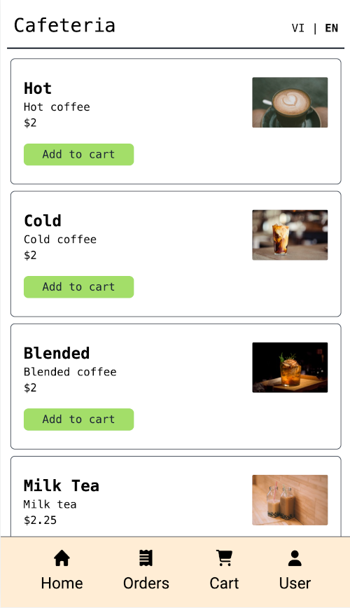

# Cafeteria App

This is a cafeteria app that allows users to order food from a cafeteria.

- **Deployed at:** [https://cafe.vietanh.dev/](https://cafe.vietanh.dev/).
- **Frontend:** Next.js with Javascript, Tailwind CSS.
- **Database:** Google Firebase.
- **Authentication:** NextAuth.js with Google OAuth.
- **Deployment:** Vercel.
- **Developers:**
  - [Viet Anh Nguyen](https://github.com/vietanhdev).
  - [Trinh Thu Hai](https://github.com/haitt00).



## 1. Design

**UI Design:** [Open in Figma](https://www.figma.com/file/NWU9BqtgXH4WZmBuEWUlVH/Cafeteria?type=design&node-id=0%3A1&t=2CNfDxghbK04aOCP-1)

## 2. Getting Started

First, run the development server:

```bash
npm run dev
```

Open [http://localhost:3000](http://localhost:3000) with your browser to see the result.

## 3. Deployment

Build the app:

```bash
npm run build
```

This app is deployed at [https://cafe.vietanh.dev/](https://cafe.vietanh.dev/).
